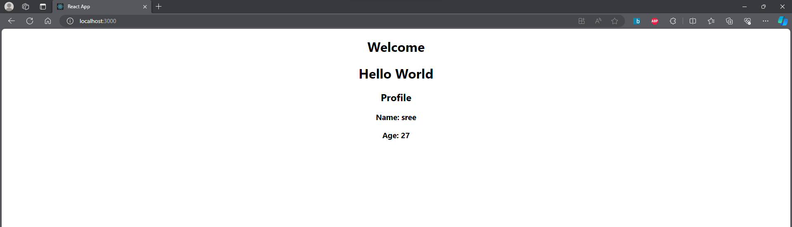
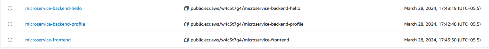

# SampleMERNwithMicroservices

### Solution

Step 1: Set Up the AWS Environment

1. Set Up AWS CLI and Boto3:

   - Install AWS CLI and configure it with AWS credentials.

   ```
   aws configure

   aws sts get-caller-identity
   ```

   - Install Boto3 for Python and configure it.

   ```
   pip install boto3
   ```
Step 2: Prepare the MERN Application

1. Containerize the MERN Application:

   - Ensure the MERN application is containerized using Docker. Create a Dockerfile for each component (frontend and backend).

### Backend - helloService Containerization

Checked and found that the index.js file, requires an environment variable for PORT

```
cd backend/helloservice

touch .env

added a variable PORT 4200
```

Created a dockerfile using node:alpine base image

```
touch Dockerfile

EXPOSE 4200

CMD - node index.js  -> as this is backend
```

### Backend - profileService Containerization

Checked and found that the index.js file, requires an environment variable for PORT and also a url for MONGO_URL

```
cd backend/profileService

touch .env

added the port 4400, and also a mongo url
```

Created a Dockerfile expose port 4400

```
EXPOSE 4400

CMD  - node index.ks -> as this is backend
```


### frontend Containerization

As per the README.md file, frontend will be exposed on port 3000

Also in the Home.js file, the backend application url are present change these, so that it can point the correct address and ports.

```
vim src/components/Home.js

added - 

http://localhost:4200/

&

http://localhost:4400/fetchUser
```

Created Dockerfile

```
touch Dockerfile

Expose port 3000

CMD - npm start
```

### Mongo

Created a mongo collection - test

added the below document - 

```

_id
65f478d60b5b79810cf4a80b
name
"sree"
age
"27"
```

### testing the dockerfiles - 

Let's Build the docker files first

# Backend - helloService
```
cd .\backend\helloService\

docker build -t narsss1234/microservice-backend-hello:latest .
```

# Backend - profileService

```
cd .\backend\profileService

docker build -t narsss1234/microservice-backend-profile:latest .
```

# Frontend

```
cd .\frontend

docker build -t narsss1234/microservice-frontend:latest .
```

### application tested locally



---------------------------------------

2. Push Docker Images to Amazon ECR:

   - Build Docker images for the frontend and backend.

   - Create an Amazon ECR repository for each image.

   - Push the Docker images to their respective ECR repositories.

As the testing is complete lets push the image to dockerhub and also ECR

```
docker push narsss1234/microservice-backend-profile:latest

docker push narsss1234/microservice-backend-hello:latest

docker push narsss1234/microservice-frontend:latest
```
Logged into AWS console - navigated to ECR

Created repos for each - backend 1,2 and frontend

ECR public repos created



```
aws ecr get-login-password --region ap-south-1 | docker login --username AWS --password-stdin 367065853931.dkr.ecr.ap-south-1.amazonaws.com

docker tag narsss1234/microservice-backend-hello:latest 367065853931.dkr.ecr.ap-south-1.amazonaws.com/microservice-backend-hello:latest

docker push 367065853931.dkr.ecr.ap-south-1.amazonaws.com/microservice-backend-hello:latest

docker tag narsss1234/microservice-backend-profile:latest 367065853931.dkr.ecr.ap-south-1.amazonaws.com/microservice-backend-profile:latest

docker push 367065853931.dkr.ecr.ap-south-1.amazonaws.com/microservice-backend-profile:latest

docker tag narsss1234/microservice-frontend:latest 367065853931.dkr.ecr.ap-south-1.amazonaws.com/microservice-frontend:latest

docker push 367065853931.dkr.ecr.ap-south-1.amazonaws.com/microservice-frontend:latest
```

Docker images have been pushed to ECR


Step 3: Version Control

 Use AWS CodeCommit:

   - Create a CodeCommit repository.

   - Push the MERN application source code to the CodeCommit repository.

1. Create a user in IAM, to create a code commit repo, as root user cannot be used to push the code to remote repo.

2. Create a ssh key so that it can be added to the user, in order to access the code commit repo.

```
cd ~/.ssh

ssh key-gen

cat ~/.ssh/codecommit_id_rsa.pub

copy the public key
```

3. Navigate to IAM to add the public key to the user security credentials

```
AWS > IAM > Users > select the user > Security Credentials tab

Navigate to SSH public keys for AWS CodeCommit > click on upload SSH public key

Paste the public key added and save
```

4. Change the config file to point the user and the private key file location

```
cd ~/.ssh

vim config

added the below lines - 

Host git-codecommit.*.amazonaws.com
        user APKAVK5WUN7VURM6W77N 
        identityfile /c/users/s896998/.ssh/codecommit_id_rsa

```

5. Test the connection 

```
ssh -T ssh://git-codecommit.ap-south-1.amazonaws.com

```

6. Change the push urls for the git - we will add both github and codecommit url here

```
git remote -v 
-> this will show the github push and fetch url

git remote set-url --add --push ssh://git-codecommit.ap-south-1.amazonaws.com/v1/repos/Graded-Project-on-Orchestration-and-Scaling

git remote -v 
-> This will show the github fetch and codecommit push URLs

# add the remote url for github

git remote set-url --add --push https://github.com/CharismaticOwl/Graded-Project-on-Orchestration-and-Scaling.git

git push
```

### Now we have the code in both github as well as code commit

Step 4: Continuous Integration with Jenkins

1. Set Up Jenkins:

   - Install Jenkins on an EC2 instance.

   - Configure Jenkins with necessary plugins.

Solution:

1. Ec2 was launched, with the below userdata.

```
#!/bin/bash
sudo apt update --fix-missing
sudo apt install git fontconfig openjdk-17-jdk -y
sudo wget -O /usr/share/keyrings/jenkins-keyring.asc \
  https://pkg.jenkins.io/debian-stable/jenkins.io-2023.key
echo deb [signed-by=/usr/share/keyrings/jenkins-keyring.asc] \
  https://pkg.jenkins.io/debian-stable binary/ | sudo tee \
  /etc/apt/sources.list.d/jenkins.list > /dev/null
sudo apt-get update
sudo apt-get install jenkins -y

# Add Docker's official GPG key:
sudo apt-get update
sudo apt-get install ca-certificates curl
sudo install -m 0755 -d /etc/apt/keyrings
sudo curl -fsSL https://download.docker.com/linux/ubuntu/gpg -o /etc/apt/keyrings/docker.asc
sudo chmod a+r /etc/apt/keyrings/docker.asc

# Add the repository to Apt sources:
echo \
  "deb [arch=$(dpkg --print-architecture) signed-by=/etc/apt/keyrings/docker.asc] https://download.docker.com/linux/ubuntu \
  $(. /etc/os-release && echo "$VERSION_CODENAME") stable" | \
  sudo tee /etc/apt/sources.list.d/docker.list > /dev/null
sudo apt-get update

sudo apt-get install docker-ce docker-ce-cli containerd.io docker-buildx-plugin docker-compose-plugin -y

sudo usermod -aG docker jenkins

sudo systemctl restart jenkins

sudo apt install awscli -y

curl -O https://s3.us-west-2.amazonaws.com/amazon-eks/1.29.0/2024-01-04/bin/linux/amd64/kubectl

curl -O https://s3.us-west-2.amazonaws.com/amazon-eks/1.29.0/2024-01-04/bin/linux/amd64/kubectl.sha256

chmod +x ./kubectl
mkdir -p $HOME/bin && cp ./kubectl $HOME/bin/kubectl && export PATH=$HOME/bin:$PATH

echo 'export PATH=$HOME/bin:$PATH' >> ~/.bashrc

# for ARM systems, set ARCH to: `arm64`, `armv6` or `armv7`
ARCH=amd64
PLATFORM=$(uname -s)_$ARCH

curl -sLO "https://github.com/eksctl-io/eksctl/releases/latest/download/eksctl_$PLATFORM.tar.gz"

# (Optional) Verify checksum
curl -sL "https://github.com/eksctl-io/eksctl/releases/latest/download/eksctl_checksums.txt" | grep $PLATFORM | sha256sum --check

tar -xzf eksctl_$PLATFORM.tar.gz -C /tmp && rm eksctl_$PLATFORM.tar.gz

sudo mv /tmp/eksctl /usr/local/bin


curl https://baltocdn.com/helm/signing.asc | gpg --dearmor | sudo tee /usr/share/keyrings/helm.gpg > /dev/null
sudo apt-get install apt-transport-https --yes
echo "deb [arch=$(dpkg --print-architecture) signed-by=/usr/share/keyrings/helm.gpg] https://baltocdn.com/helm/stable/debian/ all main" | sudo tee /etc/apt/sources.list.d/helm-stable-debian.list
sudo apt-get update
sudo apt-get install helm -y
```

2. Once the EC2 is started, configure Jenkins

```
Access using the below url:

http://<public-ip-EC2>:8080

Install the plugins, and complete the setup
```

3. Now add plguins

```
Dashboard > manage jenkins > manage plugins > available plugins

Docker
Docker build steps

AWS credentials

AWS: ALL
```

4. Add the credentials

```
Dashboard > manage jenkins > credentials > system > global

add a credential of kind AWS credentials

```

5. Create the Jenkins job and configure it with the aws codecommit repo url

2. Create Jenkins Jobs:

   - Create Jenkins jobs for building and pushing Docker images to ECR.

   - Trigger the Jenkins jobs whenever there's a new commit in the CodeCommit repository.

Solution:

1. Create Jenkinsfile

```
touch Jenkinfile
```

2. Uses agent any

3. Stage one to configure awscli, so that we can access docker push commands 

```
stage('Configure AWS Credentials') {
            steps {
                withCredentials([[
                    $class: 'AmazonWebServicesCredentialsBinding',
                    accessKeyVariable: 'AWS_ACCESS_KEY_ID',
                    secretKeyVariable: 'AWS_SECRET_ACCESS_KEY',
                    credentialsId: 'aws' // Replace with your Jenkins credentials ID
                ]]) {
                    sh 'aws configure set aws_access_key_id $AWS_ACCESS_KEY_ID'
                    sh 'aws configure set aws_secret_access_key $AWS_SECRET_ACCESS_KEY'
                    sh 'aws configure set region ap-south-1'
                }
            }
        }
```
4. Fetch the code using git plugin from thr codeCommit

```
stage('Fetch the code'){
            steps{
                script{
                    git branch: 'main', url: 'ssh://git-codecommit.ap-south-1.amazonaws.com/v1/repos/Graded-Project-on-Orchestration-and-Scaling'
                }
            }
        }
```

5. Docker build commands, to create the latest images.

```
Navigate to the floder and run docker build command

stage('Build the docker backend image 1'){
            steps{
                script{
                    sh 'cd backend/helloService && docker build -t 367065853931.dkr.ecr.ap-south-1.amazonaws.com/microservice-backend-hello:latest .'
                }
            }
        }

        stage('Build the docker backend image 2'){
            steps{
                script{
                    sh 'cd backend/profileService && docker build -t 367065853931.dkr.ecr.ap-south-1.amazonaws.com/microservice-backend-profile:latest .'
                }
            }
        }

        stage('Build the docker frontend image'){
            steps{
                script{
                    sh 'cd frontend && docker build -t 367065853931.dkr.ecr.ap-south-1.amazonaws.com/microservice-frontend:latest .'
                }
            }
        }

```

6. First do a ECR login, so that docker daemon has access to the ECR to ush the images, and then run docker push commands to upload the images.

```
stage('Configure ECR and push the images'){
            steps{
                script{
                    sh 'aws ecr get-login-password --region ap-south-1 | docker login --username AWS --password-stdin 367065853931.dkr.ecr.ap-south-1.amazonaws.com'
                    sh 'docker push 367065853931.dkr.ecr.ap-south-1.amazonaws.com/microservice-backend-hello:latest'
                    sh 'docker push 367065853931.dkr.ecr.ap-south-1.amazonaws.com/microservice-backend-profile:latest'
                    sh 'docker push 367065853931.dkr.ecr.ap-south-1.amazonaws.com/microservice-frontend:latest'
                }
            }
        }
```

### This completes our codecommit, Jenkins, and ECR stiched.

### Now when there is an upadated code push, Jenkins should automatically create the Docker images and upload then to docker repo - AWS ECR

Step 5: Infrastructure as Code (IaC) with Boto3

1. Define Infrastructure with Boto3 (Python Script):

   - Use Boto3 to define the infrastructure (VPC, subnets, security groups).

   - Define an Auto Scaling Group (ASG) for the backend.

   - Create AWS Lambda functions if needed.

   ### IaC using boto3 is work in progress, moving on with Step 10

   ### Step 10: Kubernetes (EKS) Deployment


   1. Create EKS Cluster:

   - Use eksctl or other tools to create an Amazon EKS cluster.

#   Solution - >

1. Create a folder to store the workloads and the services manifest files


2. Deploy Application with Helm:

   - Use Helm to package and deploy the MERN application on EKS.